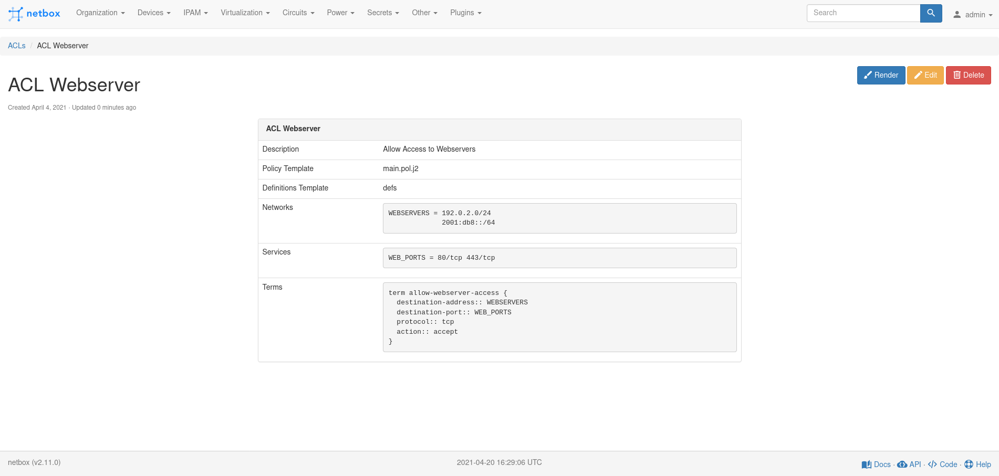
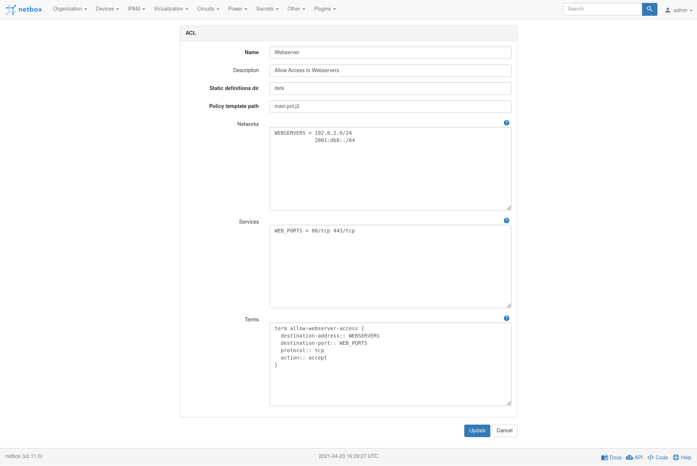
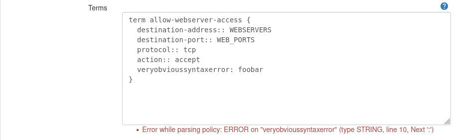
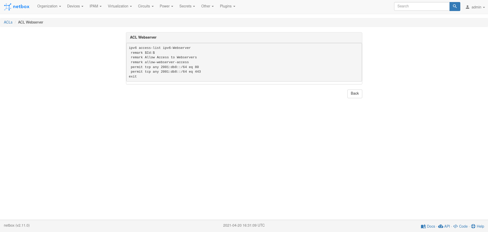
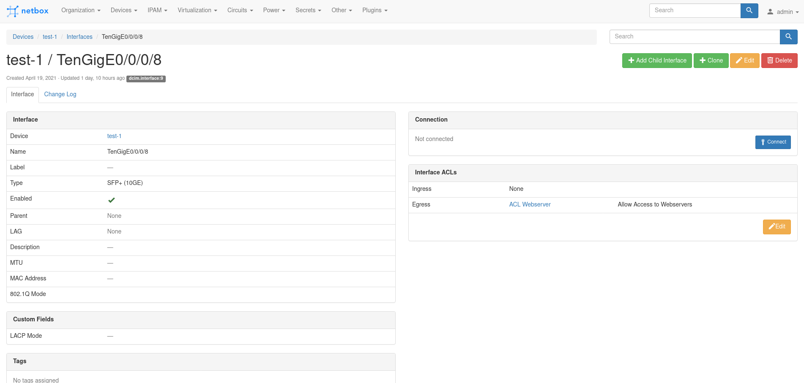
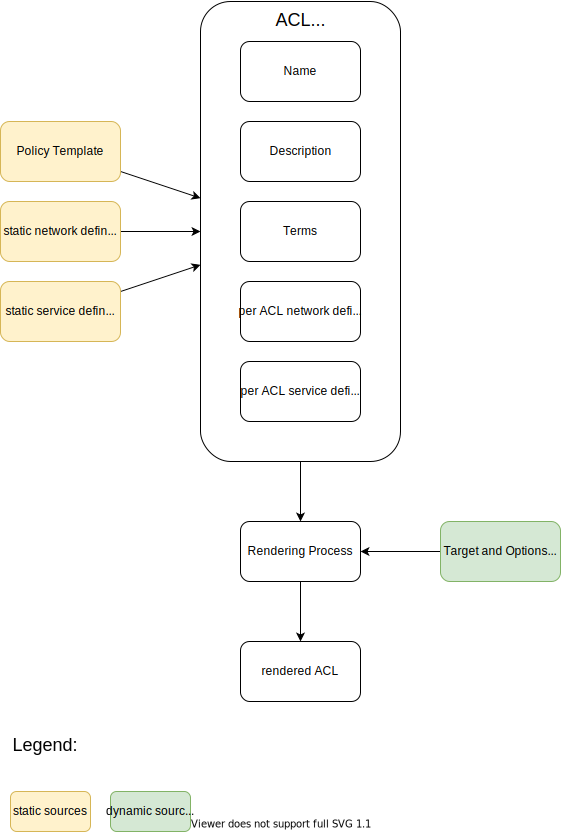

# NetBox Capirca Plugin

This plugin tries to implement a simple abstraction for Access Control Lists
(ACLs) in NetBox by leveraging the capirca ACL abstraction.

ACLs are generated from multiple data sources.

- a directory that contain static network and service definitions
- jinja2 templates for policies
- per ACL network and service definitions
- terms that are put into the policy template

ACLs can either exist on their own or can be assigned to interfaces, either as
ingress or egress ACL.
ACLs can be rendered with the capirca generators. Currently only Cisco IOS and
IOS XR are supported. If you need more, just add an issue. Supporting an other
generator is relativly easy.

# Screenshots







# Installation

Install the package in your NetBox environment. How to do this depends on
the way you have build your NetBox environment.

Create a directory for your capirca network and service definitions and
policy templates.

# Configuration

Add the plugin to the NetBox config.
```
PLUGINS = ["netbox_capirca_plugin"]
```

This plugin has there configuration parameters:

* `policy_base_path` - The directory in which the policies are
* `definitions_path` - The directory where the definitions are
* `default_policy_template` - The default template for policies (relative to
  `policy_base_path`)

In the configuration this looks e.g. like this

```
PLUGINS_CONFIG = {
    'netbox_capirca_plugin': {
        'default_policy_template': 'main.pol.j2',
        'policy_base_path': '/opt/capirca/policies/',
        'definitions_path': '/opt/capirca/defs',
    }
}
```

# Policy-Templates

The policy templates are Jinja2 Templates that are rendered into capirca policy
files.
The ACL object can be accessed as `acl` in the template.
The important keys of the ACL object are `name`, `description` and `terms`.
There is also the `target` and `options` variables.
They specify for which capirca target and with options this ACL has to be
rendered. To render a ACL for IPv4 you usually have to supply the option
`inet4` (except for `standard`/`extended` for cisco) or `inet6` for IPv6.
A simple template looks like this:

```
header {
	comment:: "{{ acl.description }}"
	target:: {{ target }} {{ acl.name }} {{ options }}
}
{{ acl.terms }}
```

## Handling unique ACL names for IPv4 and IPv6 on Cisco IOS

Cisco ACL names have to be unique. This means that if there is an extended ACL
called `foo` there can't be a IPv6 ACL called `foo`.
A trick to get around this limitation is to give the resulting ipv6 ACL a
slightly different name, e.g. `ipv6-foo`. This can be done in the template like
this:

```
header {
        comment:: "{{ acl.description }}"
        
        target:: {{ target }} ipv6-{{ acl.name }} {{ options }}
        
}
{{ acl.terms }}
```

# API

ACLs and ACLInterfaceAssignments can also be managed via the API. The API docs
can be found where the regular NetBox API docs of your installation are.

# Data Flow

The data flow for ACL rendering can be seen in this diagram:


